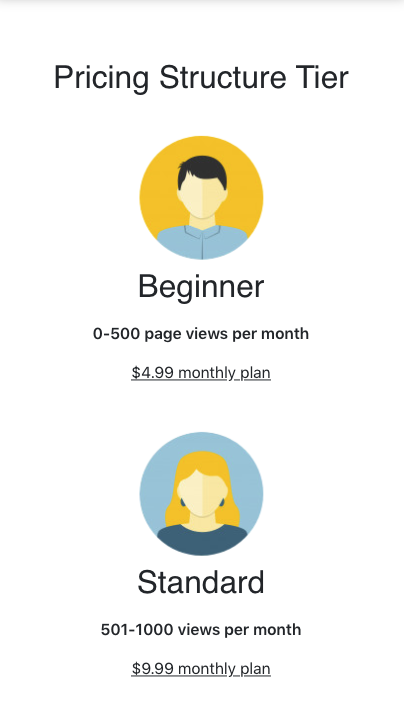

# Read Me
A responsive web application that allows users to input their monthly page view number and explore monthly pricing. For this project, I used React and added some simple and mobile responsive styling with Bootstrap.

## Goal of App
The app allows users to use E-Check to check the pricing Ezoic would charge for page views on a monthly plan. Users can type in only a number in the input form and can compare the monthly costs of other payment plans. Users can search as many possibilities as they want and they can also delete their search results as well.

## How to start
Clone the repo and run npm i and then npm start to run the application. Application will run on http://localhost:3000 and should open on the browser.

## Notes
Below are a few screenshots of the demo project on desktop and mobile device. I added the Ezoic logo and used similar colors from the website. I had a lot of fun being creative with the app so I hope you guys like what you see!

## Screenshots 

