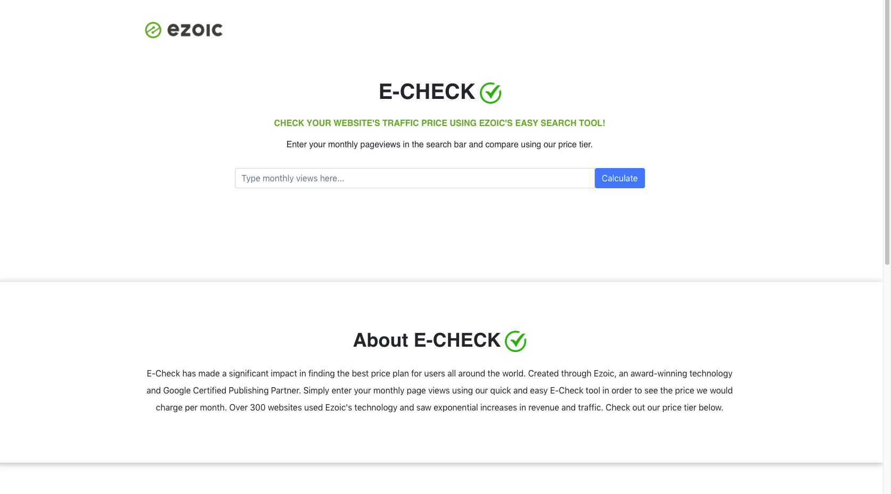
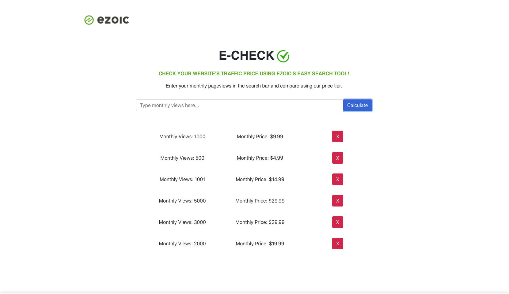
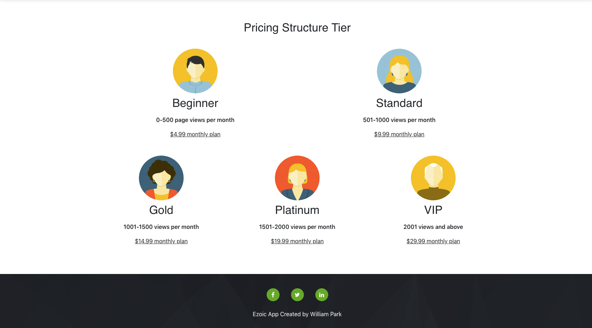

# Read Me
A responsive web application that allows users to input their monthly page view number and explore monthly pricing. For this project, I used React and added some simple and mobile responsive styling with Bootstrap. 

## How to start
Clone the repo and run npm i and then npm start to run the application.
Application will run on http://localhost:3000 and should open on the browser.
Below are some screenshots of the demo project!

## Screenshots 

