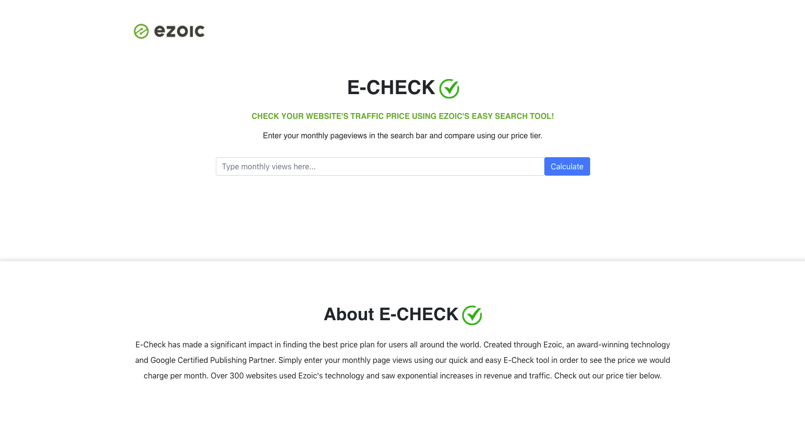
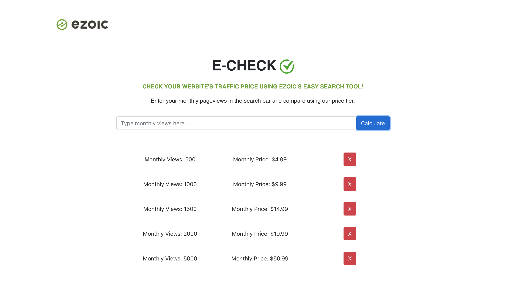

# Read Me

A responsive web application that allows users to input their monthly page view number and explore monthly pricing. For this project, I used React and added some simple and mobile responsive styling with Bootstrap. 

## How to start
In the project directory, you can start the app with: npm run start
Application will run on http://localhost:3000 and should open on the browser.

## Screenshots 

